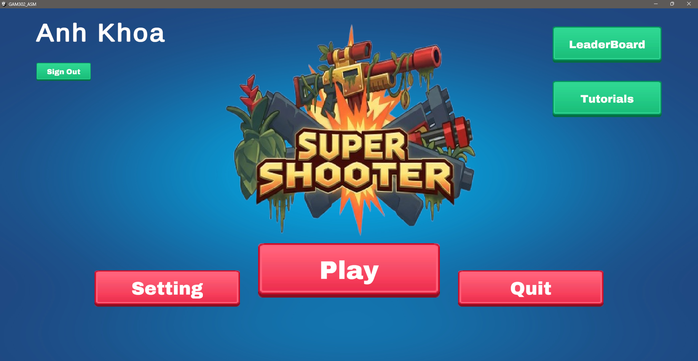
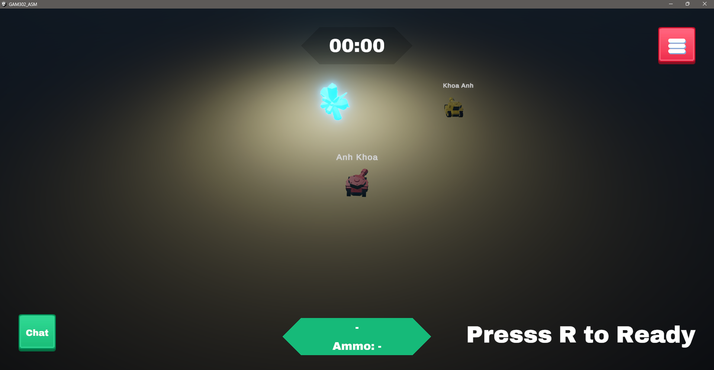
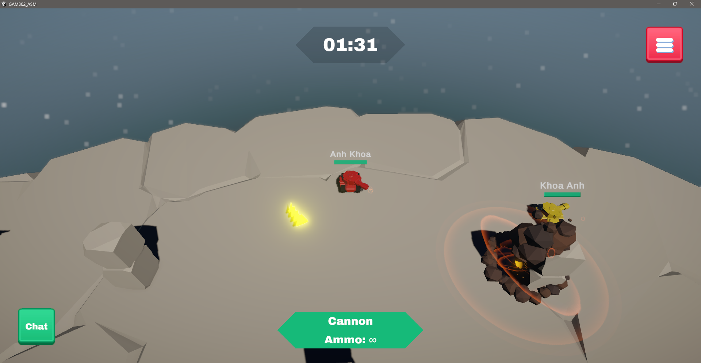
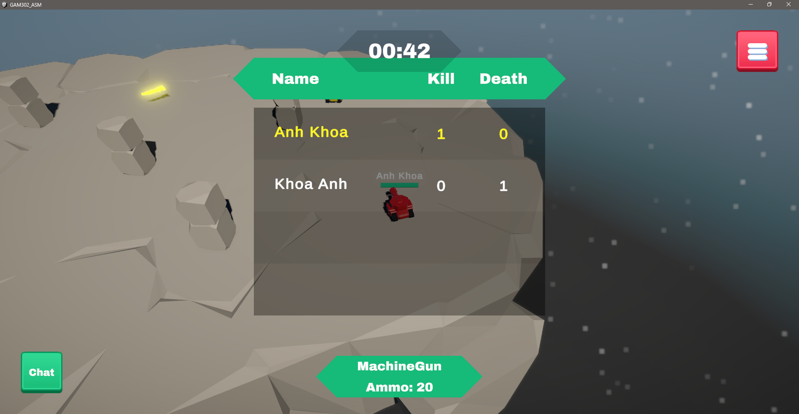

# Super Shooter

## Demo Gallery

> The images below are loaded directly from this repository, so visitors can preview the game style and arena assets immediately on GitHub.

<table>
	<tr>
		<td width="50%" align="center">
			
			 
		</td>
		<td width="50%" align="center">
			
			 
		</td>
	</tr>
	<tr>
		<td width="50%" align="center">
			
			 
		</td>
		<td width="50%" align="center">
			
			 
		</td>
	</tr>
</table>

---

## Game Overview

Super Shooter is a real-time online arena shooter where players drive tanks, rotate turrets with mouse aiming, and fight for kill score dominance before match time runs out.

### Core Loop

1. Enter player name and sign in through PlayFab.
2. Join lobby, create room, or join an existing room.
3. Players set Ready status in room lobby.
4. Host starts match when ready conditions are met.
5. Battle for 3 minutes with weapon pickups and respawn-on-death flow.
6. End-of-match winner and score summary are shown, then score uploads to PlayFab leaderboard.

---

## Gameplay Features

- Real-time multiplayer room flow using Photon Fusion (host/client).
- In-room chat using Photon Chat (channel per room).
- Turret aiming by mouse world projection with synchronized network yaw.
- Match state pipeline: Lobby -> Playing -> EndGame.
- 3-minute timed match with get-ready countdown and winner reveal.
- Dynamic scoreboard sync (kill, death, score) for all connected players.
- Auto respawn system with visual spawn effects and invulnerability transition.
- Weapon pickup spawners with weighted random drop rates and respawn timers.
- PlayFab integration for cloud leaderboard upload/fetch.

---

## Weapons

The current codebase includes these weapon classes:

- MachineGun
- Cannon
- LandMineWeapon

Weapon data is configured via ScriptableObject and includes:

- damage
- fire cooldown
- ammo capacity
- limited/unlimited ammo mode

Score calculation currently follows:

- Kill: +10
- Death: -5
- Final score is clamped to non-negative values

---

## Controls

| Action                | Input              |
| --------------------- | ------------------ |
| Move tank             | W / A / S / D      |
| Aim turret            | Mouse movement     |
| Fire                  | Left Mouse Button  |
| Ready in lobby        | R                  |
| Send chat message     | Enter              |
| Toggle scoreboard     | Hold Tab           |
| Open/close chat panel | Chat button on HUD |

---

## Scene Flow

Based on build settings:

- Index 0: MainMenu
- Index 1: Lobby
- Index 2: Level1
- Index 3: Level2
- Index 4: Level3

Create Room map selection uses dropdown index + 2 to map to Level1..Level3.

---

## Tech Stack

- Unity 2022.3.62f2
- Photon Fusion (network gameplay)
- Photon Chat (in-room chat)
- PlayFab (login + leaderboard)
- UniTask (async workflows)

---

## Quick Start

1. Open project with Unity 2022.3.62f2.
2. Ensure Photon and PlayFab credentials are configured for your environment.
3. Run one instance as Host (Create Room), second instance as Client (Join Room).
4. Mark both players Ready and start the match.
